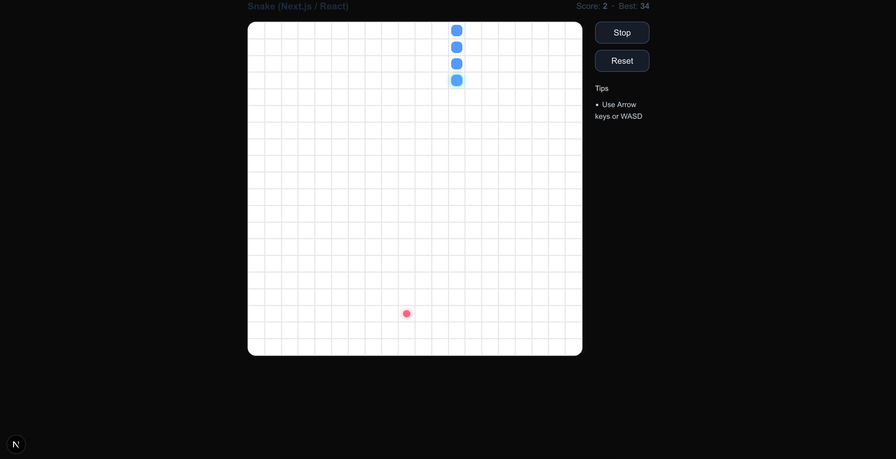

# 🐍 Next.js Snake Game

A simple browser-based **Snake Game** built with **Next.js** and React Hooks — minimal, fast, and perfect for experimenting with state updates, keyboard input, and canvas-style grid rendering in a modern frontend framework.

---

## 🖼️ Preview



---

## 🚀 Features

- Built entirely with **React + Next.js (App Router)**
- Uses **Hooks** (`useState`, `useEffect`, `useCallback`, `useMemo`)
- **Dynamic grid rendering** with configurable size and wrap-around option
- Adjustable **game speed** and responsive tick timing
- Clean, functional, and dependency-free — no external game libraries

---

## 🧩 How it Works

The game logic uses:
- A `snake` array storing the segments’ coordinates
- A `dir` state controlling movement direction
- A `food` cell placed randomly on the grid
- Collision detection and wrap-around mechanics

Game state updates on a fixed interval — the head moves, the tail trims unless food is eaten, and the canvas is re-rendered as a grid of colored cells.

---

## 🛠️ Setup & Run

Clone the repository and install dependencies:

```bash
git clone https://github.com/Tim-D-walter/snake-reactjs.git
cd minigame
npm install
npm run dev
